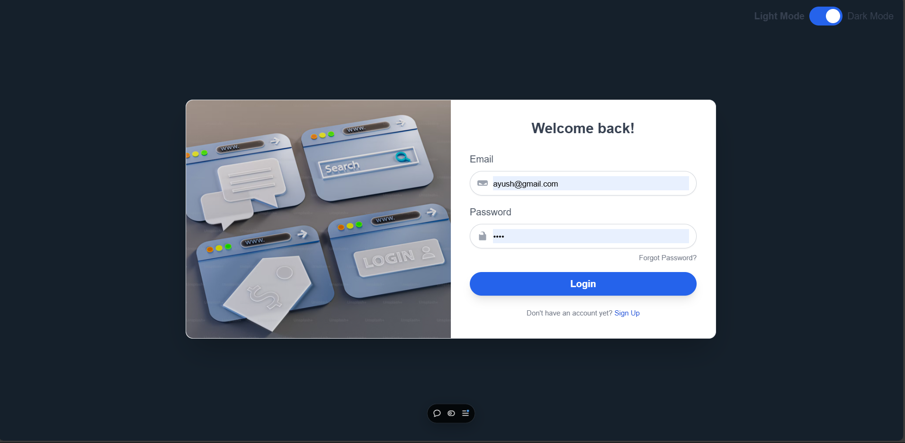
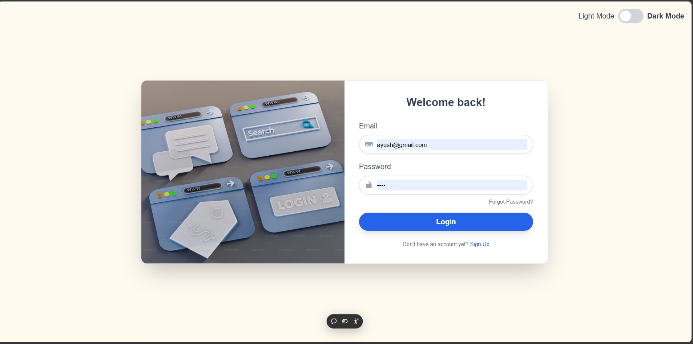
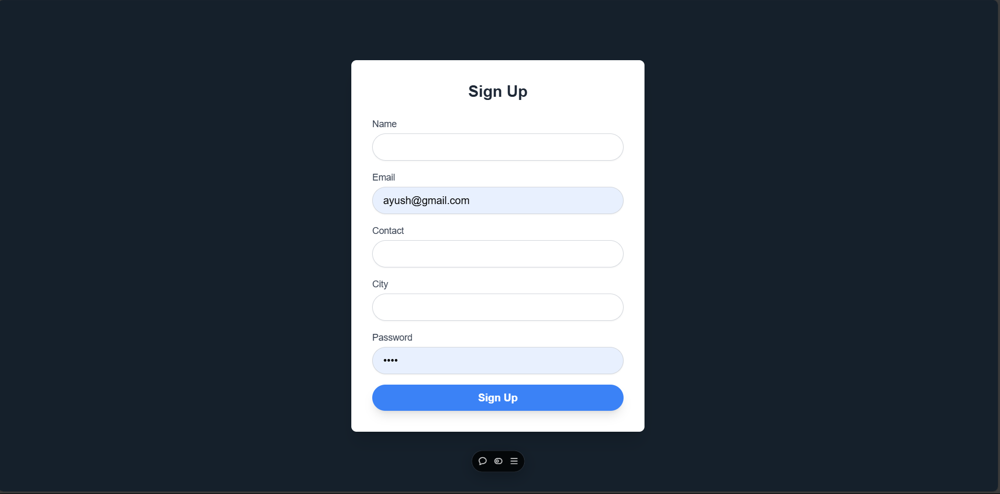
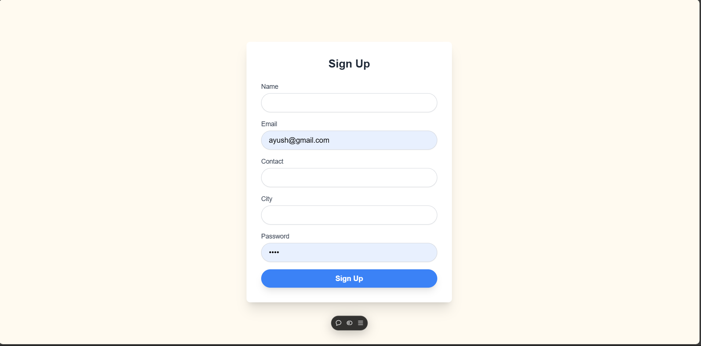
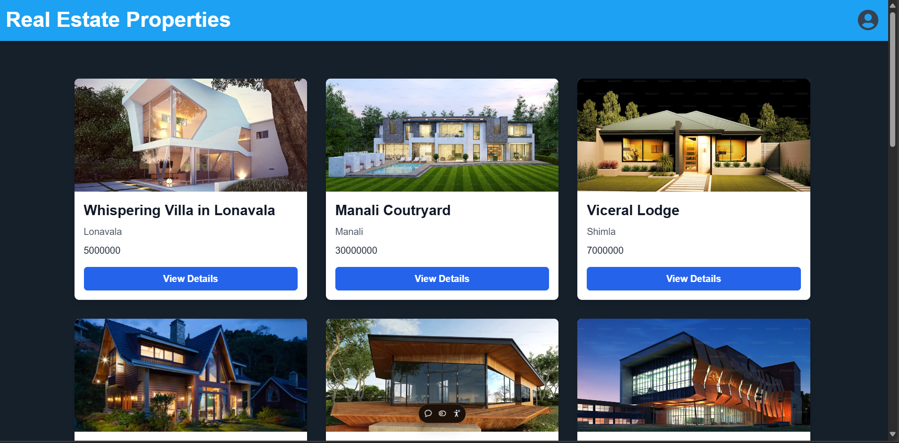
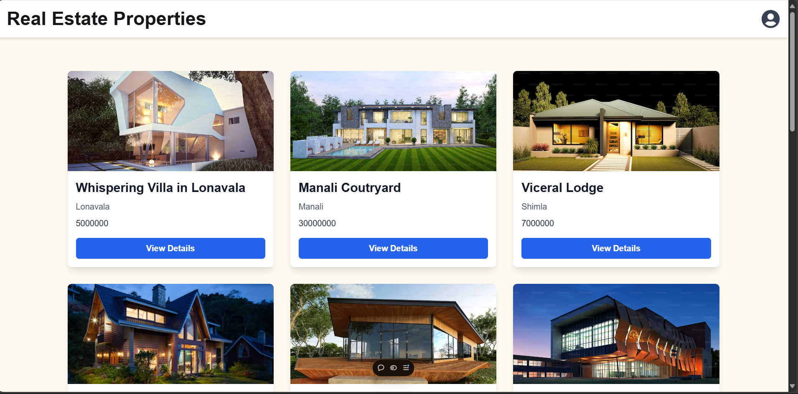
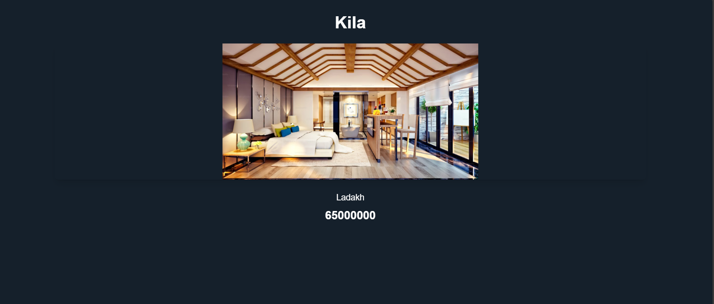
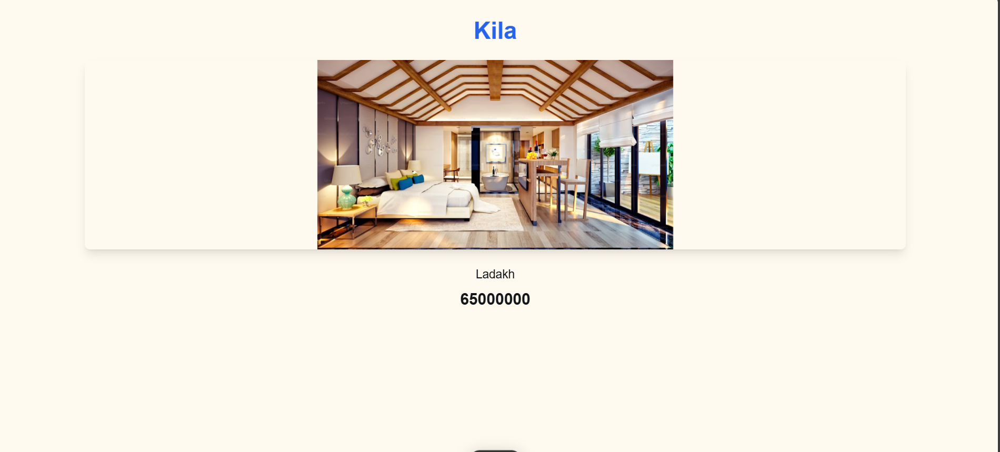

# Luxury Estate 

## Overview
This project is a luxury estate information platform where users can explore various high-end properties for sale or rent. It includes a user authentication system, a detailed property listing page, and features AI-driven property recommendations. The application is built with a *ReactJS frontend, a **Node.js/Express.js backend, and a **MongoDB* database.

## Features
- *User Authentication*: Secure login and logout functionalities using JWT tokens.
- *Property Listings*: Users can browse and search through a wide variety of luxury properties, with data fetched from a MongoDB database.
- *Responsive Design*: Fully responsive layout that works across desktop, tablet, and mobile devices.

## Technologies Used
- *Frontend*: 
  - ReactJS
  - Tailwind
  
- *Backend*: 
  - Node.js
  - Express.js
  
- *Database*: 
  - MongoDB (MongoDB Atlas for cloud hosting)
  
- *Deployment*: 
  - Hosted on [Vercel](https://xs-fe.vercel.app) (frontend)

## Project Setup

### Prerequisites
Make sure you have the following installed on your local development environment:
- [Node.js](https://nodejs.org/) (v14.x or higher)
- [MongoDB](https://www.mongodb.com/) (Atlas or Local instance)
- [npm](https://www.npmjs.com/) or [yarn](https://yarnpkg.com/)

### Installation

1. Clone the repository:
   #### Frontend
   bash
   git clone https://github.com/123AYUSH-RAI/XS_FE
   cd XS_FE
   
    #### Backend
   bash
   git clone https://github.com/123AYUSH-RAI/XS_Backend
   cd XS_Backend
   

2. Install dependencies for both frontend and backend:
   - *Backend*:
     bash
     npm install
     
   - *Frontend*:
     bash
     npm install
     

3. Set up environment variables:
   Create a .env file in the backend directory with the following:
   
   MONGO_URI=<your-mongodb-atlas-uri>
   PORT = <PORT_NUMBER>
   JWT_SECRET=<your-secret-key>
   
   

4. Start the development servers:
   - *Backend*:
     bash
     cd backend
     npm start
     
   - *Frontend*:
     bash
     cd frontend
     npm start
     
## ScreenShots 

    -*Login*:
    dark

        light

    -*SignUp*:
    dark

        light

    -Properties*-
    dark

        light

    -PropertyDetails*-
    dark

        light

## Contributors
- *Ayush Rai* - [GitHub](https://github.com/123AYUSH-RAI/)